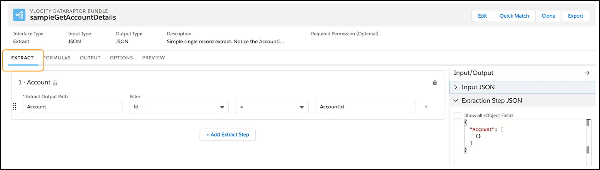

# Caracteristicas

El OmniStudio DataRaptor tab tieneÑ

- Extract tab
- Formulas tab
- Output tab
- Options tab
- Preview tab

## Extract tab

Especifica los objetos de Salesforce que desea que DataRaptor consulte y los filtros que determinan los datos que se devolverán desde el objeto.

## Formulas Tab

Se definen formulas. En los tres tipos de DataRaptors (Extract, Transform y Load) se soportan formulas. 

## Output Tab

Se mapea la información de un JSON de entrada a un JSON de salida

## Options Tab

## Preview Tab

Se testea la salida del DataRaptor. Se provee un parametro de entrada de llave/valor y se ejecuta

# Funciones

Una función de DataRaptor es una ecuación que se utiliza para operaciones que realizan lo siguiente.

- Manipular datos sobre fecha y hora.
- Encadenar texto
- Determinar un resultado basado en la lógica.
- Realizar operaciones matemáticas con números usando fracciones.

