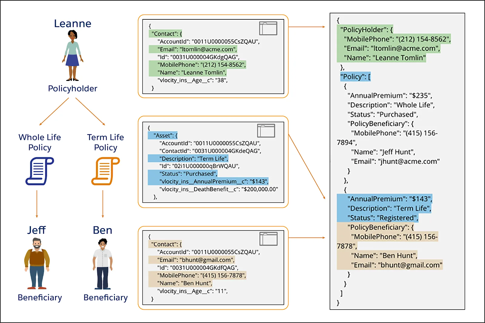

# DataRaptor

A DataRaptor es una herramienta de mapeo que permite leer, modificar y escribir información en Salesforce.

Ejemplos con el flujo de la información

1. Get Data: Un OmniScript llama a un DataRaptor Extract (Via un Integration Procedure) para leer información de Salesforce.

2. Manipulate Data
3. Save Data: Un OmniScript llama a un DataRaptor Load (Via un Integration Procedure) para escribir información de nuevo a Salesforce

```
Nota: Un DataRaptor a diferencia de un Apex Script ofrece mas beneficios como:
* Menos tiempo en crear
* Más fácil de mantener
```

## ¿Que hace cada DataRaptor?

| What it is | What it Does |
| ---------- | ------------ |
| DataRaptor Turbo Extract | Toma información de un solo objeto de Salesforce |
| DataRaptor Extract | Toma información que proviene de más de un objeto de Salesforce |
| DataRaptor Load | Guarda información en más de un objeto de Salesforce. - Actualizando registros de Salesforce - Creando registros de Salesforce - Migrando información a registros del CSV   |
| DataRaptor Transform | Manipula cualquier información que proviene de dentro y fuera de Salesforce |

## DataRaptor Turbo Extract

Revuelve y filtra la inforación de un solo objeto. Se puede filtrar la información y decidir los campos a devolver. NO SOPORTA FORMULAS

Tiene dos ventajas:

1. Fácil configuración
2. Mejor desempeño en tiempo de ejecución

## DataRaptor Extract

Es el segundo tipo de DataRaptor que trae información desde Salesforce y la devuelve en forma de JSON, XML o otra via de mapeo personalizada. Se usa normalmente para darle a los OmniScripts y FlexCards información. SOPORTA FORMULAS

Se usa si se necesitaÑ

* Extraer información de un mismo objeto
* Extraer información de tres objetos relacionados
* Paginación a través de datos ordenados usando valores de datos o valores de compensación

## DataRaptor load

Carga información desde un XML o un JSON. Un DataRaptor Load actualiza registros cambiando la información y creando nuevos registros al mismo tiempo

* Para cambiar la información se definen fórmulas
* Para definir como la informaación final esta escrita en objetos de Salesforce se mapean los campos desde una salida JSON a objetos en Salesforce

Usar un DataRaptor Load si:

- Se necesita crear un nuevo contacto usando una fórmula
- Creando un contacto para una cuenta existente

## DataRaptor Transform

Hace lo siguiente

- Convierte una entrada JSON a una salida XML y vice versa
- Reestructura información de entrada y renombra los campos
- Substituye los valores en los campos

Usarlo cuando

- Cuando un OmniScript debe de poblar una plantilla DocuSing
- Cuando un OmniScript debe completar campos de un PDF




